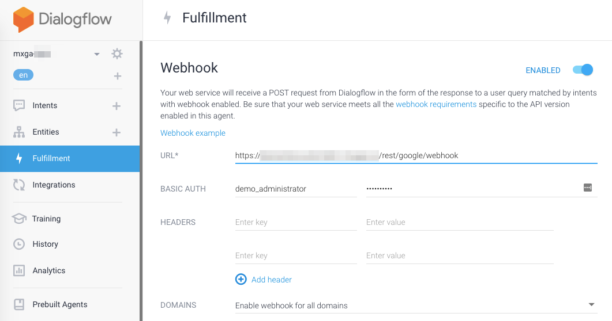

# Google Assistant Module for Mendix

* Pre-requisites
* Why should I use this?
* What can I do with it?
* What setup do I need to do?
* How does it work?
* How do I identify the Mendix user?

### Pre-requisites

To use this module, you'll need to have some level of familiarity with Google's Dialogflow tool. This is the tool that allows you to design conversational interfaces for the Google Assistant, and other voice-enabled devices. To learn more about Dialogflow, [start here](https://dialogflow.com/).

### Why should I use this?

If you want to enable your users to interact with your application through a google-assistant enabled device like a Google Home device, the Pixel Buds, or the Google Assistant on their phone.

### What can I do with it?

This module connects your Mendix application as the Fulfillment service for your Dialogflow application. In other words, your app will receive the name of the **intent** from the Dialogflow app as well as any relevant **parameters**. Your app will run a microflow to process any logic and then return a string of text for the Assistant to speak back to the user, which means that anything you can do from a Mendix microflow, you can expose to the Assistant.

### What setup do I need to do?

You need to have (or create) a Dialogflow application (called an **agent**) to serve as the interfact between your Mendix app and the Assistant. Once you install the module, you'll need to do to following one-time setup

1. Create a user and give the user the **GA_Agent** module role
2. Add a **GAUserId** attribute to your **Account** entity
3. Add **ASU_SetupActionRegistry** to your after-startup-microflow
4. Ensure that the **GA_Fulfillment** REST Service is accessible to the user you created in step 1.
5. In your **Dialogflow agent**, set the Fulfillment URL to the REST service from 4.
   
6. You're done!

### How does it work?

The high-level flow of a Dialogflow app is as follows: A user makes a **Request** (spoken words interpreted to text) to an **Agent**. The agent then determines the **Intent** of the request (a system-name for what the user is actually trying *to do*). Once the intent is known, the agent tries to fulfill the request. For simple requests, this fulfillment can be done through simple business rules "coded" into the agent itself on Dialogflow. For more complex requests, the agent can leverage a **Fulfillment** service to process the request. The Fulfillment service is a webhook that receives the "parameterized" request and then returns some content to be passed back to the agent and ultimately the user. In this implementation, the Fulfillment service passes the intent name and a generic `GoogleAssistant.Parameters` object with the parameters from the request into a Mendix microflow called `FulfillAction`. This microflow looks in the **Registry** (a mapping of intent names and microflows that is created in the **ASU** microflow) to find the correct action microflow to run. It then runs that microflow. Each action microflow takes an `Account` and `Parameters` object as parameters, and returns an `HttpResponse` object to pass back to the agent.

To add a new action to your application, follow these steps:

1. From the [Dialogflow console](https://console.dialogflow.com), create a new Intent
2. Enter training phrases and annotate them to add parameters, configure the parameters
3. Name the action in UpperCamelCase, for example: CreateRequest
4. Enable the webhook call as the intent's fulfillment
5. Save the intent
6. Return to the Mendix Modeler
7. If your action requires parameters, add those parameters to the JSON structure/Mapping as follows:
   1. Open the JSON Structure **GA_Fulfillment_Request**
   2. Find the `parameters` key under `result` in the JSON
   3. Add the key and an example value for your parameter, for example: `"name": "Conner",`
   4. Refresh the JSON Structure
   5. Open the Import Mapping with the same name
   6. From the **Select Elements** dialog, check the box next to the attribute you just added
   7. Click **Map Automatically**
8. Duplicate the **SUB_Action_Template** microflow and move it to your own module.
9. Rename the microflow **SUB_Action_{nameOfDialogflowAction}**, for example: SUB_Action_CreateRequest
10. Modify the microflow to process the intent:
    1. If your microflow requires parameters, use the split activity at the start of the microflow to check that those parameters are not empty.
    2. Execute your application logic. 
    3. Modify the **GetHTTPResponse** call to pass back a string of text to be spoken back to the user
11. Modify the **ASU_SetupActionRegistry** to add a mapping between the intent name and the action microflow:
    1. Add a new java action activity that calls the java action **AddActionToRegistry**
    2. Enter the action name as a string (from 3), for example: CreateRequest
    3. Enter the action microflow (from 8,9), for example: SUB_Action_CreateRequest
12. Publish your changes!

### How do I identify the Mendix user?

>  A future release of this module will include support for Account Linking, which is the recommended approach for identifying users on Google Assistant agents. 

For now, the best way to identify the user who is actually speaking to the Google Assistant is to implement your own custom action to register the user. An example of how to setup an action like this can be found in the microflow called **SUB_Action_Register**. To do this, create a new intent and action microflow pair called **Register**. In the intent, include some unique code as a parameter that can be easily spoken, and tied to a user. In the action microflow, include an extra string parameter called **UserId**. Use the code parameter to find the Mendix account, and then update the Mendix account by setting the **GAUserId** attribute to the value of the **UserId** parameter. My recommendation is to create a process that generates unique, short-lived codes for an account, and then your user can fire an intent by saying something like "my code is 1 2 3 4" to the Assistant. Once the user has done this once, all future interactions will be recognized by the assistant

